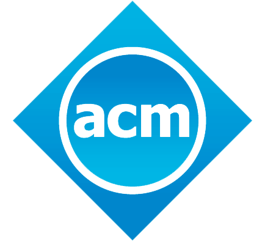
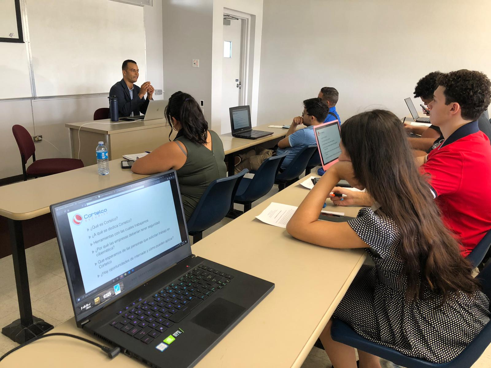
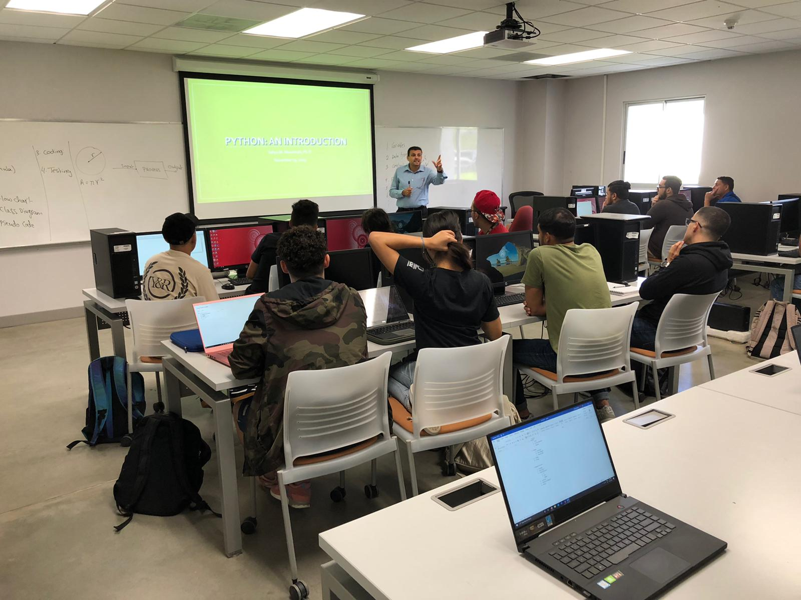
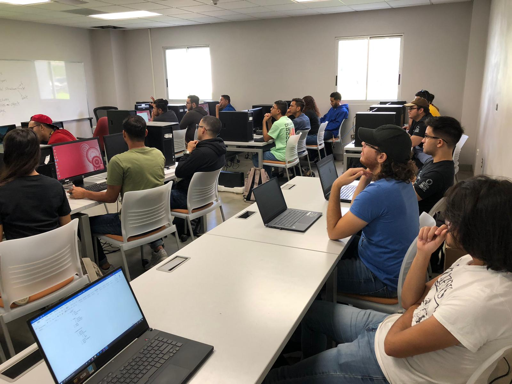
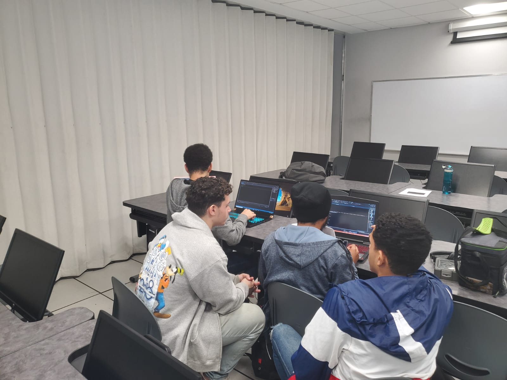
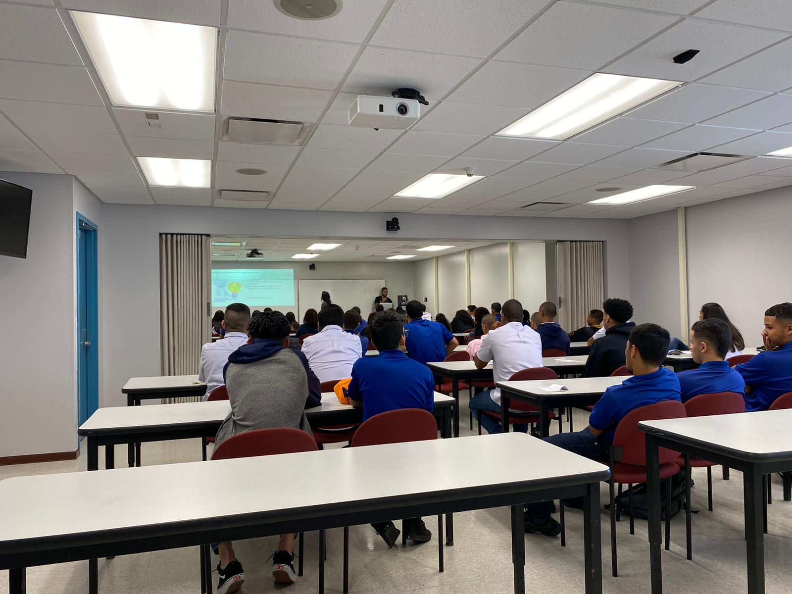

# Welcome to the ACM Turabo Student Chapter

## About Us:

The [Association for Computing Machinery](https://www.acm.org) brings together computing educators, researchers, and profesional to inspire dialogue, share resources, and address the field's challenges. As the world's largest computing society, ACM strengtns the profession's collective voice through strong leadership, promotion of the highest standards, and recognition of technical excellence. We supports the professional growth of its members by providing opportunities for life-long learnings, career development, and professional networking.

We are part of the global ACM community as a student chapter at [Universidad Ana G. Méndez - Recinto de Gurabo](http://gurabo.uagm.edu). Our mission is to increase the interest of incomming students on computer engineering and computing overall while creating a hub of students and profesionals that share the same passion for computing.

## What we do

### * Workshops

### * Seminars

### * Competitive Programming

### * And More!

### What's Next!
Stay tuned on our social media websites for more information on future events!

## Support or Contact

Follow us on [Facebook](https://www.facebook.com/ACMTuraboChapter) and [GitHub](https://github.com/ACM-Turabo)!

You can find all the materials of our workshops and seminars on our GitHub.
Never hesitate to contact us. Any questions you have in confidence we answer it as soon as possible. Feel free to contact us via [email](mailto:acm.utchapter@gmail.com)
![UAGM Logo\(images/UAGM_logo.png)
